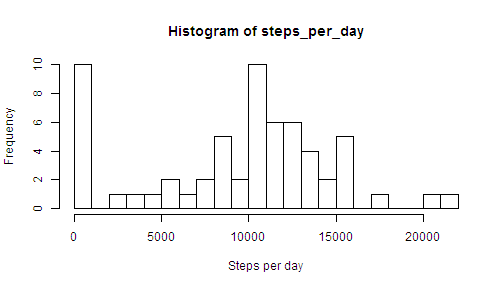
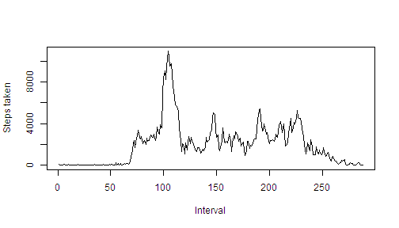

# Reproducible Research: Peer Assessment 1


## Loading and preprocessing the data


```r
unzip("activity.zip")
aData <- read.csv("activity.csv")
summary(aData)
```

```
##      steps               date          interval   
##  Min.   :  0.0   2012-10-01:  288   Min.   :   0  
##  1st Qu.:  0.0   2012-10-02:  288   1st Qu.: 589  
##  Median :  0.0   2012-10-03:  288   Median :1178  
##  Mean   : 37.4   2012-10-04:  288   Mean   :1178  
##  3rd Qu.: 12.0   2012-10-05:  288   3rd Qu.:1766  
##  Max.   :806.0   2012-10-06:  288   Max.   :2355  
##  NA's   :2304    (Other)   :15840
```

In the dataset there are 17568 row and 3 columns. The columns are "steps", "date", and "interval". The data is a record of the number of steps taken by an individual in each of 288 5-miinute intervals per day over a period of 61 days. 

## What is mean total number of steps taken per day?

```r
steps_per_day <- by(aData$steps, aData$date, sum, na.rm = TRUE)
hist(steps_per_day, breaks = 30, xlab = "Steps per day")
```

 

In the histogram, it can be seen that the most common number of steps per day is about 10,000. This can be confirmed by calculating the mean and the median.


```r
mean(steps_per_day)
```

```
## [1] 9354
```

```r
median(steps_per_day)
```

```
## 2012-10-20 
##      10395
```


## What is the average daily activity pattern?

See the time of day when the most steps are taken in the following time series plot of the sum of steps per interval.


```r
aData$interval <- as.factor(aData$interval)
steps_per_interval <- by(aData$steps, aData$interval, sum, na.rm = TRUE)
plot(steps_per_interval, type = "l", xlab = "Interval", ylab = "Steps taken")
```

 

It appears that, on average, the most steps are taken around the 100th interval, which is about 8:00 a.m. (The are 288 5-minute intervals per day or 12 per hour.)

```r
which.max(steps_per_interval)
```

```
## 835 
## 104
```

```r
max(steps_per_interval)
```

```
## [1] 10927
```

The peak is actually the 104th interval showing an average of 10,927 steps. (That's a lot of steps! Over 2000 per minute. From this one might infer that the individual in this study goes for a morning run at that time each day.)

## Imputing missing values


## Are there differences in activity patterns between weekdays and weekends?
