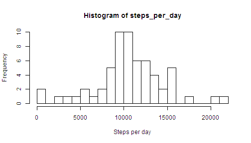

# Reproducible Research: Peer Assessment 1


## Loading and preprocessing the data


```r
unzip("activity.zip")
aData <- read.csv("activity.csv")
str(aData)
```

```
## 'data.frame':	17568 obs. of  3 variables:
##  $ steps   : int  NA NA NA NA NA NA NA NA NA NA ...
##  $ date    : Factor w/ 61 levels "2012-10-01","2012-10-02",..: 1 1 1 1 1 1 1 1 1 1 ...
##  $ interval: int  0 5 10 15 20 25 30 35 40 45 ...
```

```r
summary(aData)
```

```
##      steps               date          interval   
##  Min.   :  0.0   2012-10-01:  288   Min.   :   0  
##  1st Qu.:  0.0   2012-10-02:  288   1st Qu.: 589  
##  Median :  0.0   2012-10-03:  288   Median :1178  
##  Mean   : 37.4   2012-10-04:  288   Mean   :1178  
##  3rd Qu.: 12.0   2012-10-05:  288   3rd Qu.:1766  
##  Max.   :806.0   2012-10-06:  288   Max.   :2355  
##  NA's   :2304    (Other)   :15840
```

In the dataset there are 17568 row and 3 columns. The columns are "steps", "date", and "interval". The data is a record of the number of steps taken by an individual in each of 288 5-miinute intervals per day over a period of 61 days. 

## What is mean total number of steps taken per day?

```r
steps_per_day <- by(aData$steps, aData$date, sum, na.rm = TRUE)
hist(steps_per_day, breaks = 30, xlab = "Steps per day")
```

 

In the histogram, it can be seen that the most common number of steps per day is about 10,000. This can be confirmed by calculating the mean and the median.


```r
mean(steps_per_day)
```

```
## [1] 9354
```

```r
median(steps_per_day)
```

```
## 2012-10-20 
##      10395
```


## What is the average daily activity pattern?

See the time of day when the most steps are taken in the following time series plot of the sum of steps per interval.


```r
aData$interval <- as.factor(aData$interval)
steps_per_interval <- by(aData$steps, aData$interval, sum, na.rm = TRUE)
plot(steps_per_interval, type = "l", xlab = "Interval", ylab = "Steps taken")
```

 

It appears that, on average, the most steps are taken around the 100th interval, which is about 8:00 a.m. (The are 288 5-minute intervals per day or 12 per hour.)

```r
which.max(steps_per_interval)
```

```
## 835 
## 104
```

```r
max(steps_per_interval)
```

```
## [1] 10927
```

The peak is actually the 104th interval showing a sum of 10,927 steps. (From this, one might infer that the individual in this study goes for a morning run at that time each day.)

## Imputing missing values
The data summary at the beginning of this report shows that there are 2304 missings values (NA) for the step variable. This is about 13% of the total observations.

To "impute" the missing variables, I first calculated the average value for each interval. 


```r
step_means <- sapply(steps_per_interval, function(x) {
    round(x/61)
})
```

Then, I substituted the average value for whatever interval the NA happened to be in.


```r
imputeNAs <- function(X) {
    Y <- c()
    L <- nrow(X)
    for (i in seq(1:L)) {
        ifelse(is.na(X[i, 1]), Y <- c(Y, step_means[X[i, 3]]), Y <- c(Y, X[i, 
            1]))
    }
    return(as.vector(Y))
}

old_steps <- aData$steps
new_steps <- imputeNAs(aData)
aData$steps <- new_steps
```

A histogram of the average number of steps per day for the altered data is shown. The most notable change is a big increase in the 9,000-10,000 range. Overall the graph looks more "normal."

```r
steps_per_day <- by(aData$steps, aData$date, sum, na.rm = TRUE)
hist(steps_per_day, breaks = 30, xlab = "Steps per day")
```

 


Looking a a summary of the altered data we see that there are no missing values and that the mean is now 10,400 (up from 9,354), which makes sense since before the NA values were essential zeroes. The median went up only slightly from 10,395 to 10,400.

```r
summary(steps_per_day)
```

```
##    Min. 1st Qu.  Median    Mean 3rd Qu.    Max. 
##      41    9350   10400   10600   12800   21200
```

As I worked with the missing data, I became curious about how the NAs were distrubuted in the data. I ran The following R code to count how many NAs occured each day. It shows that the missing data are actually missing DAYS. Basically, 8 of the 61 days are missing. Given this, I think the NA values maybe should not be imputed, since each of those missing days gets replaced by identical "average" days, which would smooth the data towards the normal.

```r
aData$steps <- old_steps
nas_per_day <- by(aData$steps, aData$date, function(x) {
    sum(is.na(x))
})
as.vector(nas_per_day)
```

```
##  [1] 288   0   0   0   0   0   0 288   0   0   0   0   0   0   0   0   0
## [18]   0   0   0   0   0   0   0   0   0   0   0   0   0   0 288   0   0
## [35] 288   0   0   0   0 288 288   0   0   0 288   0   0   0   0   0   0
## [52]   0   0   0   0   0   0   0   0   0 288
```


## Are there differences in activity patterns between weekdays and weekends?
